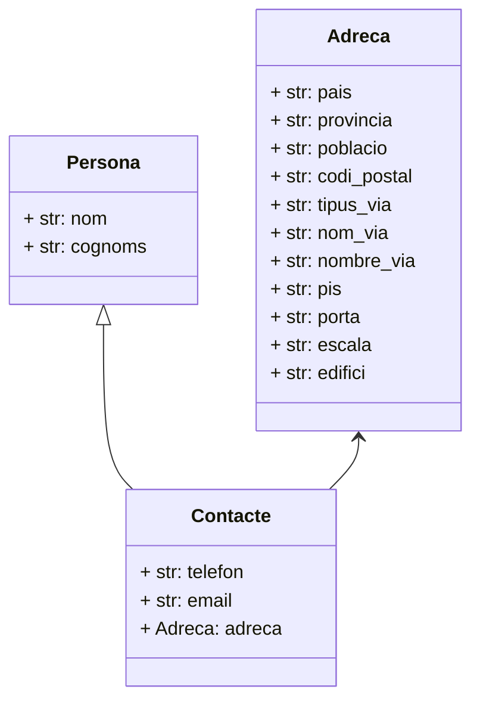

# api_rest_agenda

API REST per gestionar una agenda de contactes.
Desenvolupada durant el curs del SOC al juny de 2023.

## Diagrama de classes de l'agenda de contactes.

```mermaid
classDiagram

class Persona{
    + str: nom
    + str: cognoms
}
class Contacte{
    + str: telefon
    + str: email
    + Adreca: adreca
}
class Adreca{
    + str: pais
    + str: provincia
    + str: poblacio
    + str: codi_postal
    + str: tipus_via
    + str: nom_via
    + str: nombre_via
    + str: pis
    + str: porta
    + str: escala
    + str: edifici
}
Persona  <|-- Contacte
Adreca <-- Contacte
```
